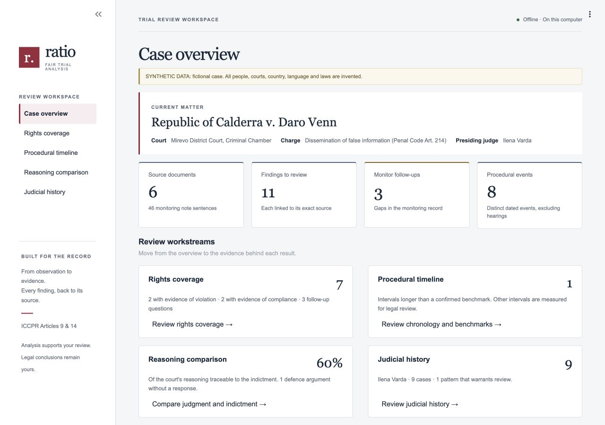

# Ratio

For the optional public-source AI demo, follow [the local Groq setup](docs/GROQ-DEMO.md). Start the React server with `--groq-demo` to draft source-linked case briefs using the configured Groq key; the default server remains offline.

For a fresh upload demonstration, [the separate real-case PDF pack](docs/DEMO-UPLOAD-PACK.md) contains three original court judgments kept out of the installed collection. Run `.venv/bin/python scripts/fetch_demo_pack.py` to download the originals and create a ZIP locally.

Ratio reads a trial's monitoring record and gives the reviewing lawyer findings to check line by line, each linked to the sentence it rests on. The legal evaluation stays with the lawyer. We built it for the FairTrial AI Hackathon (Track 2: Observation to Legal Evaluation), run by Columbia Law School's Human Rights Institute with the TrialWatch project.

It runs five checks against the international fair-trial standards (ICCPR Articles 9 and 14):

| Module | Question it answers | What you see |
|---|---|---|
| Absence Detector | Which guarantees of ICCPR Art. 14(3)(a)–(g) have no evidence of compliance? | A rights coverage grid. Where the notes say nothing, a follow-up question for the monitor instead of a finding |
| Procedural Clock | Were detention and trial delays excessive? | A timeline with measured intervals, red only where the one confirmed benchmark (48 hours to see a judge) is exceeded |
| Detention renewals | When detention was extended, was it re-examined, and was every day covered by an order? | Each detention order beside the orders before it, with the share of its grounds that repeats them highlighted, and the whole days between one order's end date and the next order |
| Reasoning Reuse Detector | Did the court reason independently of the prosecution? | The judgment beside the indictment, with copied and paraphrased passages highlighted, the share of the court's reasoning traceable to the indictment, and defence arguments the judgment never answers |
| Judicial History Tracker | Do a judge's rulings across monitored cases show a pattern that warrants review? | A judge profile: rates with sample size and confidence intervals, compared with other judges of the same court and charge type |

Every finding links to the exact sentence it rests on: click it and the source document opens with that passage highlighted. Everything runs on one laptop with open-source software, and nothing is sent to another computer.

The name comes from *ratio decidendi*, the reasoning behind a decision. Ratio's central question is whether the court did its own reasoning.



## The problem

TrialWatch lawyers review large volumes of monitoring notes, transcripts and court documents, and the hackathon's Track 2 brief calls that review a bottleneck. Before judging whether a trial was fair, a lawyer has to reconstruct what happened from that record: the notes are long and unstructured, and the documents arrive in mixed formats. Three things make the review slow and inconsistent:

- **Violations hide in omissions.** A missing interpreter or late access to counsel never appears as a sentence in the notes. A reviewer has to notice what isn't there.
- **Delay is arithmetic buried in prose.** Deciding whether detention or trial delay was excessive means pulling dates from scattered entries and comparing them by hand.
- **There is no memory across cases.** Each case is reviewed on its own, so patterns by the same judge or court are hard to see.

## How it works

```
case folder: monitoring notes, indictment, judgment, detention orders (optional), case.yaml, rulings.yaml (optional)
   │
   ▼
Extraction layer
   in code:          read and normalise the text; split it into sentences and passages with
                     character offsets; citations; "Hearing date:" headers; each detention
                     order's date and end date (orders are never sent to the model)
   local model:      dated events and party arguments, returned as exact quotes (Ollama,
                     structured JSON output, answers cached)
   alignment:        every quote is found in the source text (exact, then normalised, then
                     fuzzy for long quotes); anything not found is dropped and counted
   dates:            parsed in code with dateparser; if the model and the parser disagree,
                     both are kept and the event is marked for review
   │
   ▼
Case record: every item carries its source span (document id, start, end, exact text)
   │                                                            stored in SQLite
   ├─► Absence Detector ────┐
   ├─► Procedural Clock ────┤
   ├─► Detention renewals ──┼─► provenance check: each span is re-read from its document,
   ├─► Reuse Detector ──────┘   and a finding whose span does not match is dropped
   └─► Judicial History Tracker (all stored cases, coded rulings)
                                    │
                                    ▼
                   Streamlit app on 127.0.0.1, and the evaluation script
```

The modules read only the case record, never raw text, so each can be built and tested on its own (a test enforces this). The model never does arithmetic, never grades a person, and never decides a status on its own:

- Intervals are computed in code, and so are the dates of detention orders and the share of an order's grounds that repeats earlier orders.
- The model's labels count only when they name the rubric indicator they rely on.
- The judge statistics come from rulings coded by people.

## Setup

You need a Mac with Apple Silicon, Python 3.11, about 8 GB of free disk space, and 16 GB of memory for the live model. The locked setup targets macOS. On Linux it would also install closed-source libraries (NVIDIA's CUDA, and Intel's MKL inside PyTorch on x86-64 computers), several GB more, and it is untested. Do the setup once, while online. After that, Ratio needs no network.

```bash
git clone https://github.com/sahilkharel7/Ratio-Fair-Trial-Hackathon.git
cd Ratio-Fair-Trial-Hackathon

# Python environment with the pinned dependencies (uv: https://docs.astral.sh/uv/)
uv venv -p 3.11
source .venv/bin/activate
uv pip install -r requirements-lock.txt -e ".[dev]"
# without uv: python3.11 -m venv .venv && source .venv/bin/activate && pip install -r requirements-lock.txt -e ".[dev]"

# The embedding model (about 90 MB, saved in models/)
python scripts/fetch_models.py

# The local language model (about 4.7 GB)
brew install ollama
brew services start ollama
ollama pull qwen2.5:7b-instruct

# Stop the Ollama server from contacting ollama.com: this adds "disable_ollama_cloud": true to
# ~/.ollama/server.json, creating the file if needed and keeping any other settings in it
python3 -c 'import json, pathlib; p = pathlib.Path.home() / ".ollama" / "server.json"; s = json.loads(p.read_text().strip() or "{}") if p.exists() else {}; s["disable_ollama_cloud"] = True; p.parent.mkdir(exist_ok=True); p.write_text(json.dumps(s, indent=2) + "\n")'
brew services restart ollama

# Check that everything is ready
python -m ratio preflight
```

To use a different local model, set `RATIO_MODEL` (for example `RATIO_MODEL=mistral:7b-instruct`). The recorded demo answers belong to `qwen2.5:7b-instruct`.

## Run

```bash
streamlit run app/main.py
```

Open http://127.0.0.1:8501. The app only accepts connections from this computer.

On the **Full analysis record** page you can:

- **Load the demo case.** This replays the model's recorded answers, takes about 4 seconds, and works with Ollama stopped and Wi-Fi off.
- **Upload your own case folder.** The local model reads it live, which takes a few minutes for a case of this size.
- **Run one note live.** This shows that the recorded answers are real by comparing a fresh answer with the recorded one. It takes about 11 seconds with Ollama running.

The other pages are:

- **Rights coverage**
- **Timeline**
- **Detention renewals**: the case's detention orders in date order. An order is flagged when at least 60% of its grounds repeat earlier orders (a setting, not a legal standard), and when the next order is dated more than a day after an order's end date. Quoted law, the prosecutor's request and the operative part are left out of the comparison.
- **Reasoning reuse**
- **Judge profile**
- **State's reply**: for each finding the State would contest, the strongest reply the State could make, argued by the local model from the record so the lawyer can test the finding. The model is shown the record passages most similar to the finding and a reviewed list of grounds for its standard (`ratio/config/steelman.yaml`); General Comment wording backs the grounds that the Comments themselves recognise. Each argument must use one of those grounds and quote one passage exactly. An argument is dropped if its ground was not offered, its passage was not shown, its quote is not in that passage, it rests on the finding's own evidence where the ground needs other evidence, or a second short model check finds the quote does not show what the ground requires. Grounds left without an argument are listed as not supported by the record. The wording is the model's, shown as unverified after the block list; it is never a finding, and judge patterns get no reply.
- **Jurisprudence**: for each finding and each question for the monitor, the paragraphs of General Comments 32 and 35, and the Committee decisions they cite, linked by the standard it concerns. The same entries appear next to each finding on the other pages and in the report draft's annex. They are chosen by standard and status, never by the case's facts or by a model, and whether one applies is for the reviewing lawyer.
- **Similar cases**: past cases that share this case's fact patterns, with this case's passage beside the past case's and what the deciding body said, in its own words. See [Similar cases](#similar-cases-optional) below.
- **Precedent library**: search every paragraph of the library by the facts you type, and add your own collections of case documents; a private collection is read only by the local model. See [Your own collections](#your-own-collections-upload-a-regions-cases-no-crawling).
- **Review**: the reviewing lawyer accepts, rewords or rejects each finding (a reason is required to reword or reject) and records issues Ratio did not flag. Decisions are saved on this computer, append-only, and survive a re-analysis of the case. They appear in the report draft, where a reworded finding shows the lawyer's wording with Ratio's kept in the annex.

Any evidence button opens the source viewer. Once a case is loaded, the Case page's **Download report draft (.md)** button saves its findings as an editable Markdown draft: each finding is numbered, and its exact source text is quoted in an annex with the document and line it comes from.

The **Case overview** leads with the current matter, review summaries, and searchable
source documents. Use **Open document** to read an original document; when a search
term is found in its text, the reader opens that exact passage. Imports and live
model checks are available below the record. The shared interface components,
design tokens, and design references are documented in [docs/INTERFACE.md](docs/INTERFACE.md).

The **[hosted React preview](https://ratio-trial-review-preview.vercel.app)** brings the same
recorded synthetic pipeline outputs into a legal research workspace: unified search,
source reading, saved passages, detention-order comparisons, jurisprudence, possible
State replies, and a browser review worksheet. It does not accept uploads or run a
model. Demo decisions stay in browser storage; the offline Python application retains
SQLite review history and generates reports with the lawyer's decisions applied.
See [web/README.md](web/README.md) for building the preview and
[docs/COMBINED-WORKSPACE.md](docs/COMBINED-WORKSPACE.md) for the integration choices.

**Live demo:** follow [docs/DEMO.md](docs/DEMO.md), a three-minute script with fallback screenshots.

Command line:

```bash
python -m ratio preflight              # is this computer ready for the offline demo?
python -m ratio ingest [CASE_DIR]      # build a case record (add --live to call the local model)
python -m ratio build-demo-cache       # record the demo's model answers with Ollama
python -m ratio check-ollama           # is the local model pulled and served on 127.0.0.1?
python -m ratio report [CASE_DIR] -o report.md   # the case's findings as a Markdown report draft, with reviewers' decisions
python -m ratio feedback [--json PATH]  # reviewers' decisions per module; --json exports every decision and missed issue
python scripts/check_jurisprudence.py   # maintainers only, ONLINE: checks the jurisprudence quotes against the UN PDFs
python -m corpus_builder status         # maintainers only: the Similar cases corpus build (see below)
```

Two maintainer tools go online, besides the one-time `scripts/fetch_models.py`. `scripts/check_jurisprudence.py` is run by hand after editing `ratio/config/jurisprudence.yaml` or `steelman.yaml`, and downloads only from documents.un.org. `python -m corpus_builder` builds the Similar cases corpus from public documents (below). The app, the tests, the evaluation and the preflight never run either, and Ratio itself never downloads anything.

## Similar cases (optional)

For the case under review, Ratio lists past cases that share its fact patterns (any collections you uploaded are linked too; see below):
- UN Human Rights Committee Views;
- UN Working Group on Arbitrary Detention opinions;
- TrialWatch fairness reports.

For each shared pattern it shows this case's passage beside the past case's, and what the deciding body found, in its own words. Both open in a source viewer.

**How a link is made**
- **This case's fact patterns** come only from Ratio's own findings: a stored finding, never a "no evidence" question, and never a benchmark that needs legal review. They also come from an exact phrase in the case's documents, such as the accused described as a journalist, or the charge wording of the indictment.
- **A past case's fact patterns** come from its public text. The model quotes it, and every quote is checked word for word against the document before it is kept.
- **Ranking.** Patterns are the 15 in `ratio/config/fact_patterns.yaml`, keyed to the rubric's own ids (needs legal review). A past case needs at least 2 shared patterns, one of them about procedure. Rarer patterns rank higher, and the local MiniLM model only picks which passage to pair.
- **No model at query time.** No model runs when a link is made, and no outcome rates or predictions are shown.

**The boundary**
- `python -m corpus_builder` is a maintainer tool that runs online. It downloads public documents from the sources in `corpus_builder/sources.yaml`, obeying each site's `robots.txt` and rate limits. It then sends **only that public text** to Google Gemini to extract the fact patterns. Gemini is the only cloud service involved, and only here, at build time.
- The app never reads an API key, never calls Gemini and never sends case data anywhere.
- The built corpus lives in `data/corpus/` (git-ignored, never committed).
- The app reads the corpus file, or the OpenSearch index built from it, on 127.0.0.1 only.

**Set up**

```bash
docker compose up -d opensearch          # optional vector index on 127.0.0.1:9200; without it Ratio reads the corpus file
uv pip install -e ".[corpus]"            # the builder's Gemini SDK (maintainers only; the app never imports it; without uv: pip install -e ".[corpus]")
cp .env.example .env                     # then put GEMINI_API_KEY in .env (git-ignored)
python -m corpus_builder fetch           # ONLINE: download the seeds (robots.txt and rate limits obeyed)
python -m corpus_builder normalize       # text of each document
python -m corpus_builder extract --model gemini --model-id gemini-3.6-flash   # ONLINE: public text only
python -m corpus_builder verify          # keep only quotes found verbatim in the text
python -m corpus_builder embed           # local MiniLM vectors
python -m corpus_builder build-db        # data/corpus/precedents.db, the file the app reads
python -m corpus_builder index-opensearch   # load it into OpenSearch (optional)
```

`python -m corpus_builder extract --model ollama` uses the local model instead of Gemini: slower, but fully offline. `python -m ratio preflight` reports whether a corpus is installed and whether OpenSearch answers. Without a corpus the page says how to build one, and the rest of Ratio is unchanged.

### Your own collections: upload a region's cases, no crawling

A collection is a folder of case documents you already have, for example court decisions, monitoring reports or news reports about trials in one country. Add them on the **Precedent library** page, or from the command line. Ratio reads them into the same library as the public corpus, so they are searched and linked like any other past case.

- **Private by default.** A private collection is read only by the local model (Ollama on 127.0.0.1), and the build refuses any other model. Its files stay in the git-ignored `data/corpus/collections/<slug>/` on this computer (the name in lowercase with hyphens, e.g. `public-reports`). A collection's privacy cannot be changed after it is created.
- **Checked like everything else.** The model quotes each fact pattern word for word, and every quote is checked against the document before it is kept. A document in which the model finds no pattern, or that it could not read, is still searchable by its wording.
- **Searched by meaning and by words.** Every paragraph of every document is embedded with the local MiniLM model. A search ranks paragraphs by closeness in meaning (75%) and by the share of the query's words they contain (25%). Footnote and citation blocks are left out of the search.
- **Similar wording.** The Similar cases page also lists past cases whose paragraphs read most like this case's own, beside the fact-pattern links. Each paragraph pair opens in the source viewer, and no fact pattern is claimed for it.
- **Files:** PDF (with a text layer, not scans), `.txt`, `.md` or HTML, in English: up to 20 MB each on the page, 30 MB from the command line. Uploaded files are only read, never run.

```bash
python -m corpus_builder collection add ~/cases/indonesia --name Indonesia --region "South-East Asia"   # private
python -m corpus_builder collection add ~/reports --name "Public reports" --public                     # public material
python -m corpus_builder collection list
python -m corpus_builder collection build --name Indonesia   # local model; rebuilds the corpus file and, if running, OpenSearch
```

A public collection may also be built with `--model gemini --model-id <id>`. A private one never is: every step that calls a model refuses to give a private document to anything but the local model, and refuses Ollama cloud models. Building a collection rebuilds the corpus file from `data/corpus/build.db`, so it needs that file next to `precedents.db` (it refuses rather than drop public documents). `--no-index` leaves OpenSearch alone, and `snapshot` refuses while the corpus holds a private collection, because a snapshot is meant to be copied to other computers.

## Evaluation

```bash
python -m eval.run_eval          # replays the recorded answers; about 4 seconds, no Ollama needed
python -m eval.run_eval --live   # asks the local model wherever no answer is recorded
python -m eval.run_eval --reviews   # also checks fresh findings against reviewers' saved decisions
```

It prints the results and writes `eval/out/report.json`. It exits with an error if any finding, shown or dropped, lacked an exact source span, and, with `--reviews`, if a finding a reviewer kept is no longer produced. The current results on the demo case:

| Measure | Result |
|---|---|
| Events found, against the hand-checked timeline | 8 of 8 |
| Dates correct, among the events found | 8 of 8 |
| Expected outputs found (`data/demo/gold/expected_flags.json`: all 7 statuses, the 2 follow-up questions with their language context, and the 9 planted findings) | 18 of 18 |
| Must-not-flag violations, out of 11 planted traps (an appearance before a prosecutor, a quoted statute, the recited charge, the prosecution's argument, the caption, the court's own reasoning on the same facts, a defence argument the court did answer, a renewal that adds new grounds, the law and the prosecutor's request repeated in every order, and a renewal made on the day the previous order ended) | 0 |
| Findings that point to an exact source span | 13 of 13, none dropped |
| Judge pattern indicators that point to exact source spans | 1 of 1 |
| State's replies (model-generated): findings contested, arguments kept with exact quotes | 11 findings, 2 arguments kept (23 dropped by the checks), both quoted exactly |

These results are **in-sample**: the team wrote both the case and the expected outputs. They show that the pipeline works end to end, not how well it generalises. The main metric we planned, recall against published TrialWatch reports, has not been measured yet.

Tests:

```bash
pytest                                     # every test except the 2 that call the local model; needs models/, not Ollama
pytest -m live                             # only those 2: the local model reads a note again (start Ollama first)
pytest --cov --cov-report=term-missing     # coverage of the ratio package
```

## Responsible AI safeguards

The code and its comments refer to these as hard rules 1 to 5.

| Rule | How Ratio enforces it | How it is tested |
|---|---|---|
| **1. Runs offline, on this computer.** No cloud services, no third-party APIs, no telemetry. One exception, outside the app: the maintainer-only corpus builder sends public precedent documents, never case data, to Google Gemini at build time. | The model client only talks to Ollama on 127.0.0.1 and refuses cloud-hosted models. A network guard blocks every other connection in the app, the command line, the evaluation and the tests. Hugging Face runs in offline mode, and the embedding model loads from `models/`. Streamlit runs with usage statistics off, on 127.0.0.1 only, with no error-page links and no web fonts or remote themes. The app refuses to start if any of these settings is not in effect. | The full pipeline runs under the network guard. A global Streamlit config that tries to override the settings is ignored. The browser checks found every request going to 127.0.0.1. `python -m ratio preflight` checks these settings, any `STREAMLIT_*` environment variables that would override them, and whether the running Ollama server (or its settings file) has its cloud features disabled. |
| **2. Provenance on everything.** | The model returns exact quotes, and Ratio locates each one in the source text; quotes it can't find are dropped. A finding must carry at least one source span (document id, start, end, exact text). Before anything is stored or shown, every span is re-read from its document, and a finding whose span does not match is dropped. | The evaluation reports provenance before and after this check and fails on any unsourced finding. App tests check that every piece of evidence on every page has a button that opens its source. |
| **3. No verdicts about people.** | The messages of findings, and the short status and evidence labels shown next to them, come from fixed templates (`ratio/config/messages.yaml`). Model notes appear only under "Model note (unverified)", after words that characterise a person are removed. Judge indicators say "pattern that warrants review" only when the confidence interval for the difference from the baseline excludes zero, with the significance level divided across the indicators shown. Otherwise they say the judge is not distinguishable from the baseline at this sample size. Every rate shows n and a 95% Wilson interval. Indicators are hidden below 5 cases. The baseline is the same court and charge type only. Rulings are coded by people, never by the model. A name counts for a judge only at the same court, and doubtful names wait for a person to decide. | Known-value tests for the Wilson and Newcombe intervals. App tests check the judge page for blocked terms and for the fixed note, n and intervals. |
| **4. Public or synthetic data only.** | Every synthetic text file starts with a `SYNTHETIC:` line, and every YAML and JSON file declares `synthetic: true`. Public material must cite where it was published. Uploading a case requires a declaration; a Precedent library collection may hold private material, which is then read only by the local model and kept in the git-ignored `data/corpus/collections/`. A SYNTHETIC banner appears on every page and in the source viewer. | Every demo data file is checked for the marker. App tests check the banner on every page. |
| **5. No invented legal thresholds.** | Only one benchmark is confirmed: General Comment 35's 48 hours to bring a detainee before a judge (para. 33). Every other benchmark has a citation and no threshold, is marked "needs legal review", and is measured but never coloured. Only confirmed benchmarks can be marked as exceeded. | Config tests check that only the 48-hour benchmark is confirmed and that an unconfirmed benchmark is never coloured. |

On every judge page, above everything else: *TrialWatch monitors cases already suspected of unfairness, so these rates are not representative.*

## Data sources

- **The demo case** (`data/demo/case`): *Republic of Calderra v. Daro Venn*. It is entirely synthetic: the country, court, people, minority language and laws are invented. It has four hearing notes, the indictment, the judgment and three detention orders, with planted issues:
  - no interpreter is ever mentioned, though the defendant's first language is a minority language;
  - the defendant first appears before a judge five days after arrest, after an earlier appearance before a prosecutor that does not stop the clock;
  - four judgment passages are copied from the indictment and one is lightly paraphrased;
  - one defence argument is never answered;
  - the third detention order repeats the second order's grounds word for word, three months later, and is dated a day after the second order ran out.
- **Judicial history** (`data/demo/history`): 20 synthetic cases generated from `seed.yaml`: 19 from the demo case's court and one from another invented court. On the presiding judge's profile:
  - one indicator fires;
  - two show without a badge;
  - two are hidden as too small;
  - a name written with initials only waits for confirmation;
  - a judge with the same name at another court stays separate.
- **Standards:** the ICCPR, and Human Rights Committee General Comments [No. 32](https://documents.un.org/doc/undoc/gen/g07/437/71/pdf/g0743771.pdf) (Article 14) and [No. 35](https://documents.un.org/doc/undoc/gen/g14/244/51/pdf/g1424451.pdf) (Article 9). Paragraph numbers were checked against the official UN documents. The rubric, benchmarks and ruling codes are in `ratio/config/`.
- **Jurisprudence** (`ratio/config/jurisprudence.yaml`): 26 entries, either General Comment paragraphs in their own words or Committee decisions cited only for what a General Comment footnote cites them for (the footnote's own text), so nothing describes a decision's facts. `scripts/check_jurisprudence.py` checked every quote and citation, and the 8 General Comment quotes behind the State's-reply grounds in `ratio/config/steelman.yaml`, against the official PDFs on 2026-10-09. Decisions on the bias of individual judges are left out, so a judge pattern indicator is never shown next to one.
- **Your own cases:** use public or synthetic material only. A case folder has a `case.yaml` listing its documents (.txt, .md or .pdf), with the type, court and charge type, and whether the material is synthetic or public (with the source). It can also have a `rulings.yaml` of coded rulings for the Judicial History Tracker. `data/demo/case` is a complete example.

- **Similar cases corpus** (built locally into the git-ignored `data/corpus/`, never committed). Source list: `corpus_builder/sources.yaml`.
  - **What it holds:** 43 public documents installed locally on 2026-10-10: three ECHR judgments reproduced by official UN libraries, 23 TrialWatch fairness reports (cfj.org and hri.law.columbia.edu), 11 opinions of the UN Working Group on Arbitrary Detention (ohchr.org), and 6 UN Human Rights Committee Views (UN documents hosted by ccprcentre.org).
  - **Attribution:** every card in the app names its source, and every quote links to the passage in its document.
  - **Terms:** source attribution and the recorded terms check accompany each source. The local reader provides the saved original, full text and short source-linked reading aids. Real documents and generated PDFs remain in ignored local storage.
  - **How it was collected:** each site's `robots.txt` was obeyed. documents.un.org disallows crawlers, so no document was taken from it.
  - **Left out:** Pressing Charges, whose per-case data is not public and is "All Rights Reserved", and the TrialWatch India dataset, which is under NDA.
  - **Extraction:** optional at build time, on public documents only. The installed corpus currently has paragraph vectors without model-extracted fact-pattern facets; phrase and meaning search work without a Gemini key. The runtime never loads the cloud SDK.

- **Collections you upload** stay in the git-ignored `data/corpus/collections/` and are never committed. Upload only material you may use; mark a collection private unless it is public.

No real monitoring notes and no published TrialWatch reports are in this repository.

## Limitations

- **The evaluation is in-sample, on one synthetic case.** Ratio has not been tested on published TrialWatch reports yet.
- **Legal review is pending.** The rubric indicators, the three unconfirmed benchmarks, the reuse standards and the ruling codes were drafted by the engineering team and need review by a lawyer. Until then they are marked "needs legal review", and only the 48-hour benchmark is applied.
- **English only.** Sentence splitting, date parsing and the patterns that recognise statutes, charges and party positions are tuned for English. Multilingual input was cut from the hackathon scope.
- **A small local model makes mistakes.**
  - Every model output is checked against the source text, and dates are parsed in code, but an event the model misses is simply absent.
  - Reading a whole case live takes minutes.
- **Reuse counting is conservative.** A judgment sentence that quotes the law and then applies it is excluded as a statute quotation, so any copying in it is not counted.
- **Detention orders are read by fixed patterns.** An order's date must be on a "Date:", "Order date:" or "Dated:" caption line, and its end date must follow "until" in a sentence about detention, custody or remand. An order with neither is kept and reported as not measurable. A renewal for a fixed period with no end date written ("for two months") is not converted into a date.
- **The jurisprudence corpus is small and chosen by standard.** It covers 16 paragraphs of General Comments 32 and 35 and 10 decisions they cite. An entry is linked to every finding on its standard, however different the facts, and the choice of which entries go with which standard needs legal review.
- **The Judicial History Tracker runs on synthetic history only.**
  - Coded rulings must be written by hand.
  - TrialWatch's case selection makes the rates unrepresentative, as every judge page says.
  - A judge whose surname is also a title word (for example "Justice") waits for a person to confirm the name.
- **The recorded demo answers match exact prompts.** In the demo, one similarity comparison that selects notes for the model is decided by a margin of 0.0012. On a computer whose arithmetic differs slightly (another operating system or processor), that selection could change, and with it one prompt; the replay would then stop with "no cached labels reply for this request". `python -m ratio preflight` detects this and prints the command that records the missing answer with Ollama running.
- **Platforms:** tested on macOS with Apple Silicon. PyTorch no longer publishes wheels for Intel Macs.
- **The State's strongest reply is conservative and small-model.** The checks drop most of what a 7B model proposes (23 of 25 arguments on the demo), so a missing reply means the record passages shown supported no ground, not that the State has no answer. Ollama's answers can vary slightly between runs even at temperature 0; the demo replays the recorded ones.

## Project layout

```
ratio/
  extraction/     reading, sentence splitting, chunking, model extraction, span alignment, dates
  modules/        absence.py, clock.py, renewal.py, reuse.py, judges.py (with the exclusion rules, name registry and statistics)
  config/         rubric.yaml, benchmarks.yaml, ruling_codes.yaml, standards.yaml, messages.yaml, settings.yaml
  schema.py       the case record (frozen pydantic models)
  results.py      module outputs
  provenance.py   every finding re-checked against its source text
  llm.py          local Ollama client with a replayable answer cache
  netguard.py     blocks every connection that does not stay on this computer
  store.py        SQLite case store, with reviewers' decisions
  feedback.py     lawyers' corrections: the decision in force, per-module summary, regression check
  preflight.py    pre-demo checks
  report.py       the Markdown report draft export
  precedents.py   Similar cases: this case's fact patterns and the ranked links (no model at query time)
  precedent_store.py, precedent_opensearch.py   the corpus file (source of truth) and the optional OpenSearch index
corpus_builder/   maintainer-only, online: fetch, normalize, extract (Gemini, public text only), verify, embed, build the corpus;
                  collections.py (with store.py) reads uploaded collections with the local model: the only modules the app imports
app/              Streamlit app: main.py, views/ (one file per page), ratio_ui/ (source viewer, widgets, privacy check)
data/demo/        synthetic demo case, expected outputs, judicial history, recorded model answers
eval/             evaluation script
scripts/          one-time model download, the history generator, the jurisprudence check, and the web preview's data export
tests/
docs/             demo script, screenshots, interface notes and the workspace merge notes
web/              React preview of the recorded synthetic demo (static; see web/README.md)
```

## Team

Komal Neupane, Sahil Kharel, Hardik Kafle, Emeric Chang.

## License

Ratio's own code, synthetic data and documentation are licensed under the [Apache License 2.0](LICENSE). Copyright 2026 Komal Neupane, Sahil Kharel, Hardik Kafle and Emeric Chang.

`ratio/config/` quotes the ICCPR and passages from the UN Human Rights Committee's General Comments No. 32 and No. 35, with their citations. Those are United Nations texts, not the team's work, so the Apache license does not cover them.

### Third-party software

This repository contains no third-party code. The setup steps download Ratio's dependencies from PyPI, the embedding model from Hugging Face and the language model from Ollama's library, each under its own license.

- **unidecode is licensed under the GNU GPL (version 2 or later).** Ratio uses it to match names and words written with accents or with look-alike letters from other alphabets, and almost every part of Ratio loads it.
  - Installing, using and changing Ratio, and copying it within your own organisation, create no obligations. The simplest way to share Ratio is to send the link to this repository.
  - If you give people Ratio *together with* its installed dependencies (a container, a disk image, a packaged app or a prepared laptop), the Free Software Foundation's view is that they form one program. That program must be passed on under the GNU GPL version 3, with its complete source code. Ratio's Apache license allows this.
  - The Foundation counts copies given to contractors, such as external monitors, as passing Ratio on.
  - Separate programs on the same computer, such as Ollama and its model, are not affected.
- **Other copyleft parts.**
  - certifi, tqdm, hf-xet, setuptools, Pillow and SciPy contain code under the Mozilla Public License, the GNU Lesser GPL, or the GPL with the GCC Runtime Library Exception. On some platforms NumPy, scikit-learn and PyTorch do too.
  - Streamlit's built-in fonts are under the SIL Open Font License.
  - Pass these licenses, and the source code they require, on with any bundle.
  - Everything else uses permissive licenses such as MIT, BSD and Apache 2.0.
- **Closed-source parts outside macOS.** On macOS, which the setup targets, everything Ratio installs is open source. Elsewhere:
  - On Linux, PyTorch's standard build installs NVIDIA's closed-source CUDA libraries: most of the `nvidia-*` packages (brought in by the `cuda-toolkit` metapackage), NVIDIA tools inside `triton`, and, on ARM computers, NVIDIA math libraries inside PyTorch itself.
  - On x86-64 Linux and Windows, PyTorch contains Intel's closed-source MKL library, even in its CPU-only build.
  - Ratio does not need a GPU, so PyTorch's CPU-only build leaves out NVIDIA's libraries. On ARM Linux that build is entirely open source.
  - A GPL bundle for x86-64 Linux or Windows would need a PyTorch built without MKL.
- **Models.** [all-MiniLM-L6-v2](https://huggingface.co/sentence-transformers/all-MiniLM-L6-v2) and [Qwen2.5-7B-Instruct](https://huggingface.co/Qwen/Qwen2.5-7B-Instruct) (`qwen2.5:7b-instruct` in Ollama) are licensed under Apache 2.0, and Ollama under MIT. If you set `RATIO_MODEL` to another model, check its license: some models, including other sizes of Qwen2.5, are not open source.

This is a summary, not legal advice.

### Court judgments and local one-pagers

The React homepage leads with original court judgments. International review keeps Human Rights Committee Views, Working Group opinions and monitoring reports labelled separately. Charges, prosecutor requests and imposed sentences are distinct. See [the corpus research notes](docs/CORPUS-RESEARCH.md) for the focus, case directories and local build instructions.

```bash
python -m corpus_builder fetch --source echr_judgments
python -m corpus_builder normalize
python -m corpus_builder embed
python -m corpus_builder build-db
pip install -e ".[pdf]"
python scripts/build_case_briefs.py
npm --prefix web run build
python scripts/serve_workspace.py --port 8503
```

The three editorial court summaries have checked source pinpoints and source hashes. Other references receive explicitly labelled extractive reading sheets until a model draft is generated and legally reviewed. Downloads refuse changed source text, invented supporting quotes and altered PDFs. No real corpus text is exported into the static preview.
